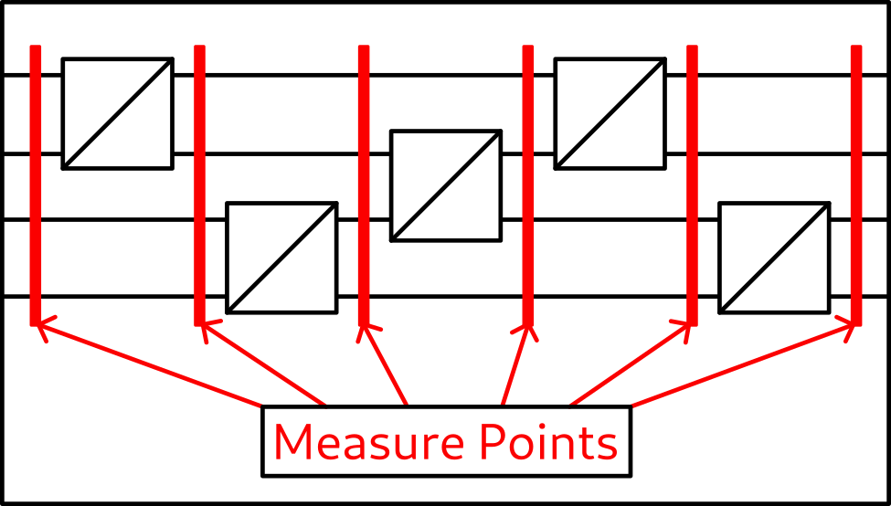
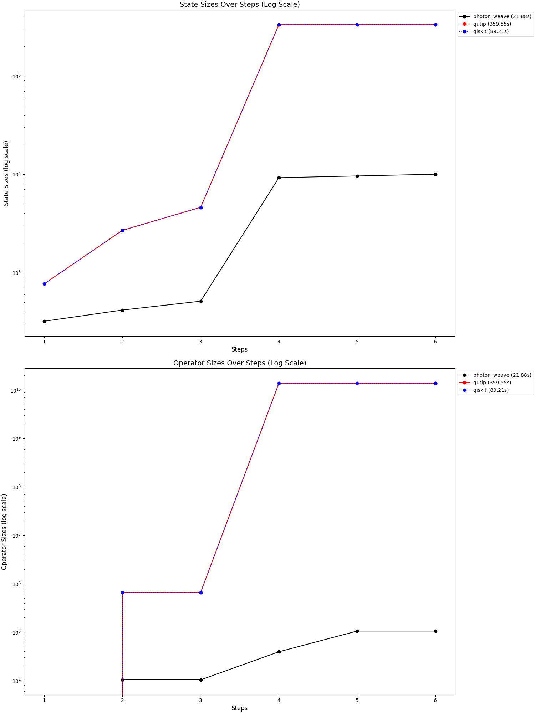

# Benchmarks

All of the benchmarks were carried out on the ThinkPad X1 Carbon 6th Gen:

## Lossy Beam Splitter Circuit
In this benchmark, we test a circuit containing five lossy beam splitters. After each beamsplitter operates on a state, one photon is absorbed in both modes. Tis setup serves as an exercise in managing large product spaces, domenstsarating dimension adjustments, operator construction without padding, and applying opreators directly to the relevant subspace. We measure execution time and track the sizes of states and operators at each step.

### Results

### Comments

- **Memory Efficiency**: Photon Weave's dimension-adjustment feature leads to lower memory consumption  for states, a capability not currently available in Qiskit or QuTip.
- **Operator Construction**: In Photon Weave, operators are applied directly to the relevant subspace without padding, further reducing operator size. This, combined with liwer dimensionality, significantly decreases memory usage.
- **Execution Speed**: These features, along with JAX's JIT functionality, translates into substantially faster execution times in this benchmark.

### Bottleneck & Constraints
Operator construction remains a bottleneck because operators are represented as large square matrices. This limitation restricts the benchmar from scaling to higher input photon numbers. In this test, the input $|2\rangle$ was used. For larger photon-number states, QuTip and Qiskit require excessive memory to construct the necessary operators, making the benchmark impractical at higher dimensions. 

## State Management
